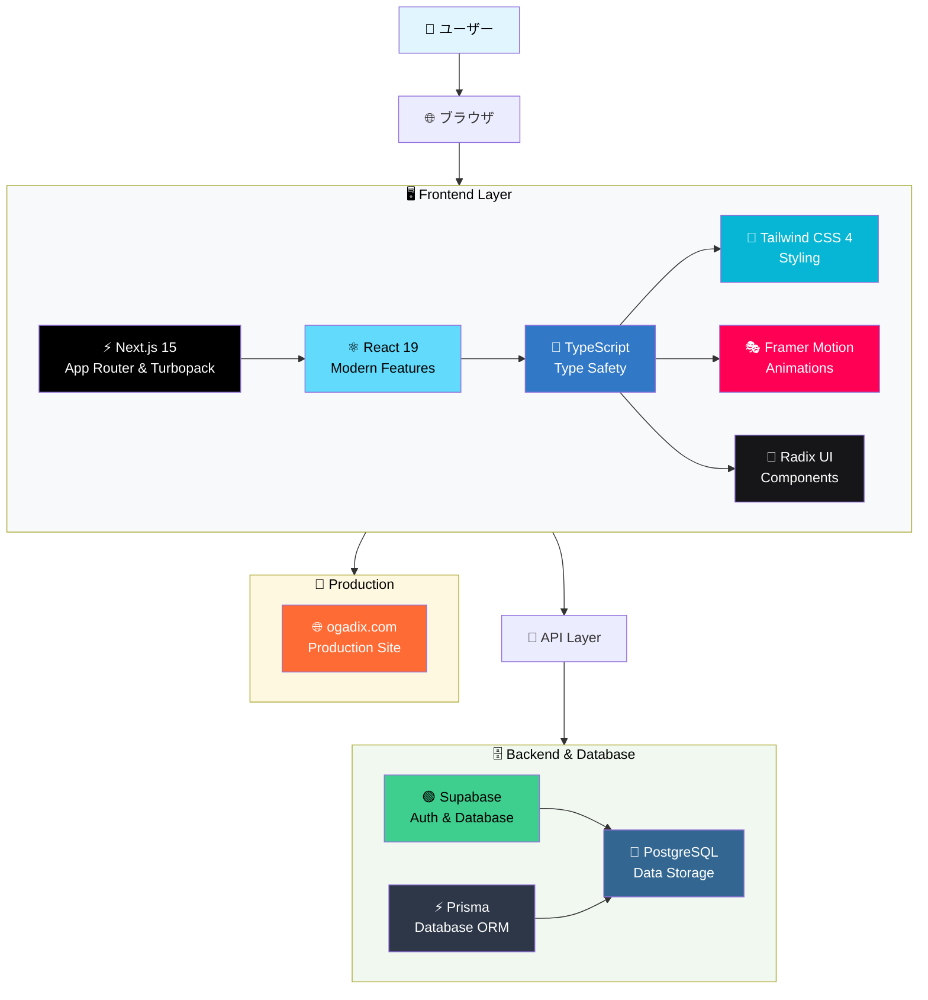

# 🚀 Dev Elite Academy

**高年収エンジニア育成総合プラットフォーム**

エンジニア3年目から年収800万円以上を目指す実践的学習プラットフォーム。DevOps、AI/ML、セキュリティ、アーキテクチャ設計まで、将来性のある技術スキルを体系的に習得できます。

🌐 **本番環境**: [https://ogadix.com](https://ogadix.com)

## 🎯 プロジェクトの目的

- **年収向上**: 市場価値の高いスキルを習得し年収800万円以上を目指す
- **実践的学習**: 実際の業務で使える技術を hands-on で学習
- **キャリア戦略**: 転職、昇進、独立まで視野に入れたキャリア設計
- **継続的成長**: 最新技術動向に対応した継続学習システム

## 🔧 技術スタック

### システムアーキテクチャ



### 開発・デプロイメントフロー

```mermaid
graph LR
    Dev[👨‍💻 Developer] --> Code[📝 Code]
    Code --> Git[📦 Git Repository]

    subgraph Development[🛠️ Development Tools]
        ESLint[🔍 ESLint<br/>Code Linting]
        Prettier[✨ Prettier<br/>Code Formatting]
        TypeScript[🔷 TypeScript<br/>Type Checking]
    end

    Code --> Development

    Git --> GitHub[📁 GitHub Repository]
    GitHub --> Actions[⚙️ GitHub Actions<br/>CI/CD Pipeline]

    Actions --> Build[🔨 Build Process<br/>⚡ Next.js + Turbopack]
    Build --> Test[🧪 Quality Checks<br/>ESLint + TypeScript]
    Test --> Deploy[🚀 Deploy to ogadix.com]

    Deploy --> Production[🌐 Production Environment<br/>ogadix.com]

    style Dev fill:#e1f5fe,color:#000
    style Development fill:#f8f9fa,color:#000
    style Actions fill:#f0f8f0,color:#000
    style Production fill:#fff8e1,color:#000
    style ESLint fill:#4b32c3,color:#fff
    style Prettier fill:#f7b93e,color:#000
    style TypeScript fill:#3178c6,color:#fff
    style GitHub fill:#24292e,color:#fff
    style Build fill:#000000,color:#fff
    style Test fill:#10b981,color:#fff
    style Deploy fill:#ff6b35,color:#fff
```



### 技術詳細
- **Frontend**: Next.js 15 with App Router & Turbopack, React 19, TypeScript, Tailwind CSS 4, Framer Motion, Radix UI
- **Backend**: Supabase (Authentication & Database), PostgreSQL, Prisma ORM
- **Development**: GitHub Actions CI/CD, ESLint & Prettier, ogadix.com deployment

## 📚 学習モジュール

### 📖 基本情報技術者試験 (**実装済み**)
IT基礎知識を体系的に学習する国家資格対策
- **テクノロジ系**: コンピュータシステム、プログラミング、データベース、ネットワーク、セキュリティ
- **マネジメント系**: システム開発、プロジェクト管理
- **ストラテジ系**: 経営戦略、企業法務
- 進捗管理機能、学習統計表示、8分野詳細学習コンテンツ

### 1. 🌩️ DevOps & AWS
クラウドインフラ、CI/CD、コンテナ化、監視システム

### 2. 🤖 AI & 機械学習
機械学習、LLM活用、データサイエンス、MLOps

### 3. 🛡️ セキュリティ
ペネトレーションテスト、脆弱性診断、セキュリティ運用

### 4. 🏗️ システム設計
アーキテクチャ設計、スケーラビリティ、パフォーマンス

### 5. 👥 リーダーシップ
チームマネジメント、プロジェクト管理、ビジネススキル

### 6. 🎯 キャリア戦略
年収向上、ポートフォリオ構築、転職戦略、市場価値分析

## 🚀 Getting Started

### Prerequisites
- Node.js 18.x or later
- npm or yarn
- Git

### Installation

1. **Clone the repository**
   ```bash
   git clone https://github.com/Gaku52/dev-elite-academy.git
   cd dev-elite-academy
   ```

2. **Install dependencies**
   ```bash
   npm install
   ```

3. **Run the development server**
   ```bash
   npm run dev
   ```

4. **Open browser**
   ```
   http://localhost:3000
   ```

### Available Scripts

```bash
npm run dev        # 開発サーバー起動（Turbopack使用）
npm run build      # プロダクションビルド（Turbopack使用）
npm run start      # プロダクションサーバー起動
npm run lint       # ESLint実行
npm run typecheck  # TypeScript型チェック
npm run db:migrate # データベースマイグレーション
npm run db:seed    # データベースシード
```

## 🎯 ロードマップ

### Phase 1: 基盤構築 ✅
- [x] Next.js プロジェクト初期化
- [x] UI/UX デザインシステム
- [x] GitHub Actions CI/CD
- [x] ダッシュボード・ナビゲーション
- [x] ogadix.com 本番環境デプロイ

### Phase 2: 学習機能実装 ✅
- [x] 基本情報技術者試験モジュール
- [x] 8分野体系的学習コンテンツ
- [x] 進捗管理・学習統計機能
- [x] クイズ・演習システム

### Phase 3: データベース統合 ✅
- [x] Supabase 認証・データ管理
- [x] PostgreSQL データベース設計
- [x] ユーザー学習履歴システム
- [x] 進捗分析・可視化機能

### Phase 4: 高度機能・拡張 （進行中）
- [ ] AWS リソース連携
- [ ] AI アシスタント・学習支援
- [ ] コミュニティ・メンタリング
- [ ] 追加学習モジュール展開

## 📞 Contact

**Gaku52** - [@Gaku52](https://github.com/Gaku52)

- **Project Repository**: [https://github.com/Gaku52/dev-elite-academy](https://github.com/Gaku52/dev-elite-academy)
- **Live Application**: [https://ogadix.com](https://ogadix.com)

---

**🎯 目標**: エンジニア3年目 → 年収800万円以上のハイスキルエンジニア
