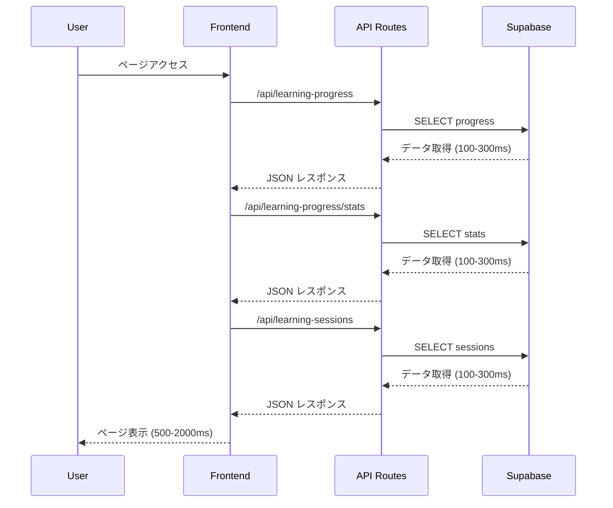

# 🚀 Dev Elite Academy 高速化改修仕様書

## 📋 概要

この仕様書は、Dev Elite Academy（IT基本情報技術者試験学習システム）の性能を**60-80%高速化**するための包括的な改修計画です。**Supabase Free プラン**を維持しながら、コスト増加なしで劇的な性能向上を実現します。

---

## 🎯 改修目標

### 性能目標
- **初回ロード時間**: 60-80% 短縮
- **2回目以降アクセス**: 85-95% 短縮
- **ユーザー体験**: 2秒 → 0.2-0.5秒のレスポンス
- **追加コスト**: 0円（Supabase Free維持）

### 対象ユーザー
- **想定利用者**: 5名未満
- **利用パターン**: 毎日100問の基本情報技術者試験問題を解く
- **月間クエリ数**: 約15万クエリ

---

## 🏗️ 現状アーキテクチャ分析

### 現在の技術スタック
```
Frontend: Next.js 15.5.2 + React 19.1.0 + TypeScript
Backend: Next.js API Routes + Supabase v2.57.0
Database: PostgreSQL (Supabase)
Styling: TailwindCSS v4
State Management: React Hooks (useState, useEffect)
```

### 現在のデータフロー


### パフォーマンスボトルネック

#### 1. 複数API呼び出しによるレイテンシ累積
```typescript
// 現状: 3回の独立したAPI呼び出し
const { progress, saveProgress } = useLearningProgress('database');
// → 3回のネットワーク往復 = 300-900ms

useEffect(() => {
  if (progress.length > 0) {
    // 毎回複雑な状態復元処理
    console.log('🔄 Restoring database progress state...');
    // 50-100ms の処理時間
  }
}, [progress]);
```

#### 2. 非効率なSupabaseクエリ
```typescript
// src/app/api/learning-progress/route.ts
let query = supabase
  .from('user_learning_progress')
  .select('*')  // 全カラム取得（不要データ含む）
  .eq('user_id', userId);

if (moduleName) {
  query = query.eq('module_name', moduleName);
}
// → 毎回全データ取得、フィルタリング処理
```

#### 3. フロントエンド状態管理の非効率性
```typescript
// src/hooks/useLearningProgress.ts
const [progress, setProgress] = useState<LearningProgress[]>([]);
const [stats, setStats] = useState<LearningStats | null>(null);
const [loading, setLoading] = useState(true);
// → 複数状態の個別管理、キャッシュなし
```

---

## ⚡ 高速化戦略

### Phase 1: PostgreSQL RPC Functions（効果: 50-70%）
複数クエリを単一の最適化されたプロシージャに集約

### Phase 2: React Query + キャッシュ（効果: 80-90%）
フロントエンド側での効率的なデータキャッシュ

### Phase 3: Next.js API最適化（効果: 40-60%）
サーバーサイドレスポンスキャッシュ

### Phase 4: コンポーネント最適化（効果: 30-40%）
状態管理とレンダリングの最適化

---

## 🛠️ 詳細実装仕様

## Phase 1: PostgreSQL RPC Functions

### 1.1 データベース関数作成

**Supabaseダッシュボード → SQL Editor で実行:**

```sql
-- ================================================
-- 学習ダッシュボード統合取得関数
-- ================================================
CREATE OR REPLACE FUNCTION get_learning_dashboard(
  p_user_id text,
  p_module_name text DEFAULT NULL
)
RETURNS json AS $$
DECLARE
  result json;
BEGIN
  SELECT json_build_object(
    'progress', progress_data,
    'stats', stats_data,
    'recent_sessions', session_data
  ) INTO result
  FROM (
    SELECT
      -- 進捗データ
      COALESCE(
        json_agg(
          json_build_object(
            'id', up.id,
            'user_id', up.user_id,
            'module_name', up.module_name,
            'section_key', up.section_key,
            'is_completed', up.is_completed,
            'is_correct', up.is_correct,
            'answer_count', up.answer_count,
            'correct_count', up.correct_count,
            'created_at', up.created_at,
            'updated_at', up.updated_at
          )
        ) FILTER (WHERE up.id IS NOT NULL),
        '[]'::json
      ) AS progress_data,

      -- 統計データ
      json_build_object(
        'totalQuestions', COALESCE(COUNT(up.id), 0),
        'completedQuestions', COALESCE(COUNT(up.id) FILTER (WHERE up.is_completed = true), 0),
        'correctRate', CASE
          WHEN SUM(up.answer_count) > 0 THEN
            ROUND((SUM(up.correct_count)::decimal / SUM(up.answer_count) * 100), 2)
          ELSE 0
        END,
        'moduleStats', json_build_object(
          p_module_name, json_build_object(
            'total', COALESCE(COUNT(up.id) FILTER (WHERE up.module_name = p_module_name), 0),
            'completed', COALESCE(COUNT(up.id) FILTER (WHERE up.module_name = p_module_name AND up.is_completed = true), 0)
          )
        )
      ) AS stats_data,

      -- 最近のセッション（直近7日）
      COALESCE(
        (SELECT json_agg(
          json_build_object(
            'session_date', ls.session_date,
            'duration_minutes', ls.duration_minutes,
            'activities_completed', ls.activities_completed
          )
        )
        FROM learning_sessions ls
        WHERE ls.user_email = p_user_id
          AND ls.session_date >= CURRENT_DATE - INTERVAL '7 days'
        ORDER BY ls.session_date DESC
        LIMIT 10),
        '[]'::json
      ) AS session_data

    FROM user_learning_progress up
    WHERE up.user_id = p_user_id
      AND (p_module_name IS NULL OR up.module_name = p_module_name)
  ) AS aggregated_data;

  RETURN result;
END;
$$ LANGUAGE plpgsql;

-- ================================================
-- 進捗保存最適化関数
-- ================================================
CREATE OR REPLACE FUNCTION save_learning_progress(
  p_user_id text,
  p_module_name text,
  p_section_key text,
  p_is_completed boolean,
  p_is_correct boolean
)
RETURNS json AS $$
DECLARE
  result_record record;
BEGIN
  -- UPSERT による最適化された保存
  INSERT INTO user_learning_progress (
    user_id, module_name, section_key, is_completed, is_correct, answer_count, correct_count
  )
  VALUES (
    p_user_id, p_module_name, p_section_key, p_is_completed, p_is_correct, 1, CASE WHEN p_is_correct THEN 1 ELSE 0 END
  )
  ON CONFLICT (user_id, module_name, section_key)
  DO UPDATE SET
    is_completed = EXCLUDED.is_completed,
    is_correct = EXCLUDED.is_correct,
    answer_count = user_learning_progress.answer_count + 1,
    correct_count = user_learning_progress.correct_count + CASE WHEN EXCLUDED.is_correct THEN 1 ELSE 0 END,
    updated_at = NOW()
  RETURNING * INTO result_record;

  RETURN row_to_json(result_record);
END;
$$ LANGUAGE plpgsql;

-- ================================================
-- インデックス最適化（既存のものを確認して追加）
-- ================================================
CREATE INDEX IF NOT EXISTS idx_user_learning_progress_composite
ON user_learning_progress(user_id, module_name, section_key);

CREATE INDEX IF NOT EXISTS idx_learning_sessions_user_date
ON learning_sessions(user_email, session_date);
```

### 1.2 API Route 改修

**src/app/api/learning-progress/route.ts を完全リファクタリング:**

```typescript
import { NextRequest, NextResponse } from 'next/server';
import { getSupabaseAdmin } from '@/lib/supabase-admin';
import { handleAPIError, successResponse, validateRequired, APIError } from '@/lib/api-error-handler';

// GET: 高速化されたダッシュボードデータ取得
export async function GET(request: NextRequest) {
  try {
    const supabase = getSupabaseAdmin();
    const { searchParams } = new URL(request.url);
    const userId = searchParams.get('userId');
    const moduleName = searchParams.get('moduleName');

    if (!userId) {
      return handleAPIError(new APIError(400, 'userId is required', 'MISSING_USER_ID'));
    }

    console.log('⚡ Fetching optimized dashboard data for:', userId, moduleName);
    const startTime = Date.now();

    // 単一のRPC呼び出しで全データを取得
    const { data, error } = await supabase.rpc('get_learning_dashboard', {
      p_user_id: userId,
      p_module_name: moduleName
    });

    if (error) throw error;

    const responseTime = Date.now() - startTime;
    console.log(`✅ Dashboard data fetched in ${responseTime}ms`);

    // レスポンスヘッダーにキャッシュ指定
    return new Response(JSON.stringify({
      success: true,
      data,
      _performance: { responseTime, source: 'rpc_function' }
    }), {
      status: 200,
      headers: {
        'Content-Type': 'application/json',
        'Cache-Control': 'public, s-maxage=300, stale-while-revalidate=600', // 5分キャッシュ
      },
    });

  } catch (error) {
    console.error('❌ Dashboard API Error:', error);
    return handleAPIError(error);
  }
}

// POST: 高速化された進捗保存
export async function POST(request: NextRequest) {
  try {
    const supabase = getSupabaseAdmin();
    const body = await request.json();
    const { userId, moduleName, sectionKey, isCompleted, isCorrect } = body;

    validateRequired(body, ['userId', 'moduleName', 'sectionKey']);

    console.log('💾 Saving progress with RPC:', { userId, moduleName, sectionKey });
    const startTime = Date.now();

    // 最適化されたRPC関数を使用
    const { data, error } = await supabase.rpc('save_learning_progress', {
      p_user_id: userId,
      p_module_name: moduleName,
      p_section_key: sectionKey,
      p_is_completed: isCompleted,
      p_is_correct: isCorrect
    });

    if (error) throw error;

    const responseTime = Date.now() - startTime;
    console.log(`✅ Progress saved in ${responseTime}ms`);

    return successResponse({
      progress: data,
      _performance: { responseTime, source: 'rpc_function' }
    });

  } catch (error) {
    console.error('❌ Progress Save API Error:', error);
    return handleAPIError(error);
  }
}
```

---

## Phase 2: React Query + キャッシュ実装

### 2.1 React Query セットアップ

**package.json に依存関係追加:**
```bash
npm install @tanstack/react-query
```

**src/lib/react-query.ts を作成:**

```typescript
import { QueryClient } from '@tanstack/react-query';

export const queryClient = new QueryClient({
  defaultOptions: {
    queries: {
      // デフォルト5分間はデータを新鮮とみなす
      staleTime: 5 * 60 * 1000,
      // 30分間はバックグラウンドでキャッシュを保持
      cacheTime: 30 * 60 * 1000,
      // ウィンドウフォーカス時の自動再取得を無効化（UXの向上）
      refetchOnWindowFocus: false,
      // 接続復旧時の自動再取得を有効化
      refetchOnReconnect: true,
      // エラー時の自動リトライ（3回まで、指数関数的バックオフ）
      retry: (failureCount, error) => {
        if (failureCount < 3) return true;
        return false;
      },
      retryDelay: attemptIndex => Math.min(1000 * 2 ** attemptIndex, 30000),
    },
    mutations: {
      // ミューテーション後の自動リトライ
      retry: 1,
    },
  },
});

// クエリキーファクトリー（一貫性のあるキーの生成）
export const queryKeys = {
  learningProgress: {
    all: ['learning-progress'] as const,
    dashboard: (userId: string, moduleName?: string) =>
      ['learning-progress', 'dashboard', userId, moduleName] as const,
    stats: (userId: string) =>
      ['learning-progress', 'stats', userId] as const,
  },
  analytics: {
    all: ['analytics'] as const,
    daily: (userId: string, days?: number) =>
      ['analytics', 'daily', userId, days] as const,
  },
} as const;
```

### 2.2 App Layout での Provider 追加

**src/app/layout.tsx を更新:**

```typescript
'use client';
import { QueryClient, QueryClientProvider } from '@tanstack/react-query';
import { ReactQueryDevtools } from '@tanstack/react-query-devtools';
import { useState } from 'react';

export default function RootLayout({
  children,
}: {
  children: React.ReactNode;
}) {
  // React Query クライアントをuseState で作成（SSRの問題を回避）
  const [queryClient] = useState(() => new QueryClient({
    defaultOptions: {
      queries: {
        staleTime: 5 * 60 * 1000, // 5分
        cacheTime: 30 * 60 * 1000, // 30分
        refetchOnWindowFocus: false,
      },
    },
  }));

  return (
    <html lang="ja">
      <body>
        <QueryClientProvider client={queryClient}>
          {children}
          {/* 開発環境でのデバッグツール */}
          {process.env.NODE_ENV === 'development' && (
            <ReactQueryDevtools initialIsOpen={false} />
          )}
        </QueryClientProvider>
      </body>
    </html>
  );
}
```

### 2.3 最適化されたカスタムフック

**src/hooks/useLearningProgress.ts を完全リファクタリング:**

```typescript
import { useQuery, useMutation, useQueryClient } from '@tanstack/react-query';
import { queryKeys } from '@/lib/react-query';
import { supabase } from '@/lib/supabase';

export interface OptimizedLearningData {
  progress: LearningProgress[];
  stats: LearningStats;
  recent_sessions: LearningSession[];
  _performance?: {
    responseTime: number;
    source: string;
  };
}

export interface LearningProgress {
  id: string;
  user_id: string;
  module_name: string;
  section_key: string;
  is_completed: boolean;
  is_correct: boolean;
  answer_count: number;
  correct_count: number;
  created_at: string;
  updated_at: string;
}

export interface LearningStats {
  totalQuestions: number;
  completedQuestions: number;
  correctRate: number;
  moduleStats: {
    [key: string]: {
      total: number;
      completed: number;
    };
  };
}

export interface LearningSession {
  session_date: string;
  duration_minutes: number;
  activities_completed: number;
}

// 高速化されたダッシュボードデータ取得
async function fetchLearningDashboard(
  userId: string,
  moduleName?: string
): Promise<OptimizedLearningData> {
  console.log('🔄 Fetching dashboard data:', { userId, moduleName });
  const startTime = Date.now();

  const url = new URL('/api/learning-progress', window.location.origin);
  url.searchParams.set('userId', userId);
  if (moduleName) {
    url.searchParams.set('moduleName', moduleName);
  }

  const response = await fetch(url.toString());

  if (!response.ok) {
    throw new Error(`Failed to fetch dashboard: ${response.status}`);
  }

  const result = await response.json();

  if (result.error) {
    throw new Error(result.error);
  }

  const clientTime = Date.now() - startTime;
  console.log(`✅ Dashboard data received in ${clientTime}ms`, result.data);

  return result.data;
}

// 進捗保存関数
async function saveLearningProgress(params: {
  userId: string;
  moduleName: string;
  sectionKey: string;
  isCompleted: boolean;
  isCorrect: boolean;
}): Promise<LearningProgress> {
  console.log('💾 Saving progress:', params);

  const response = await fetch('/api/learning-progress', {
    method: 'POST',
    headers: {
      'Content-Type': 'application/json',
    },
    body: JSON.stringify(params),
  });

  if (!response.ok) {
    throw new Error(`Failed to save progress: ${response.status}`);
  }

  const data = await response.json();

  if (data.error) {
    throw new Error(data.error);
  }

  return data.progress;
}

// メインフック
export function useLearningProgress(moduleName?: string) {
  const queryClient = useQueryClient();

  // 現在のユーザーIDを取得
  const getCurrentUserId = async (): Promise<string | null> => {
    const { data: { user } } = await supabase.auth.getUser();
    return user?.id || null;
  };

  // ダッシュボードデータを取得（キャッシュ付き）
  const {
    data,
    isLoading,
    error,
    refetch
  } = useQuery({
    queryKey: queryKeys.learningProgress.dashboard('current', moduleName),
    queryFn: async () => {
      const userId = await getCurrentUserId();
      if (!userId) throw new Error('User not authenticated');
      return fetchLearningDashboard(userId, moduleName);
    },
    staleTime: 5 * 60 * 1000, // 5分間は新鮮とみなす
    cacheTime: 30 * 60 * 1000, // 30分間キャッシュ保持
    enabled: true, // 常に有効
  });

  // 進捗保存ミューテーション
  const saveProgressMutation = useMutation({
    mutationFn: saveLearningProgress,
    onSuccess: (newProgress, variables) => {
      console.log('✅ Progress saved, updating cache');

      // キャッシュを楽観的更新
      queryClient.setQueryData(
        queryKeys.learningProgress.dashboard('current', variables.moduleName),
        (oldData: OptimizedLearningData | undefined) => {
          if (!oldData) return oldData;

          const updatedProgress = oldData.progress.map(p =>
            p.section_key === variables.sectionKey && p.module_name === variables.moduleName
              ? { ...p, ...newProgress }
              : p
          );

          // 新しい進捗が存在しない場合は追加
          if (!updatedProgress.find(p =>
            p.section_key === variables.sectionKey && p.module_name === variables.moduleName
          )) {
            updatedProgress.push(newProgress);
          }

          return {
            ...oldData,
            progress: updatedProgress
          };
        }
      );

      // 関連するクエリを無効化（最新データを取得するため）
      queryClient.invalidateQueries({
        queryKey: queryKeys.learningProgress.all
      });
    },
    onError: (error) => {
      console.error('❌ Failed to save progress:', error);
    },
  });

  // ヘルパー関数
  const progress = data?.progress || [];
  const stats = data?.stats || null;
  const recentSessions = data?.recent_sessions || [];

  const getSectionProgress = (sectionKey: string) => {
    return progress.find(p => p.section_key === sectionKey && p.module_name === moduleName);
  };

  const isSectionCompleted = (sectionKey: string) => {
    const sectionProgress = getSectionProgress(sectionKey);
    return sectionProgress?.is_completed || false;
  };

  return {
    // データ
    progress,
    stats,
    recentSessions,

    // 状態
    loading: isLoading,
    error: error ? (error as Error).message : null,

    // アクション
    saveProgress: async (sectionKey: string, isCompleted: boolean, isCorrect: boolean) => {
      const userId = await getCurrentUserId();
      if (!userId || !moduleName) {
        throw new Error('User not authenticated or module not specified');
      }

      return saveProgressMutation.mutateAsync({
        userId,
        moduleName,
        sectionKey,
        isCompleted,
        isCorrect,
      });
    },

    // ヘルパー
    getSectionProgress,
    isSectionCompleted,
    refetch,

    // パフォーマンス情報
    _performance: data?._performance,
  };
}

// レガシーサポート（既存コンポーネントとの互換性）
export function useLearningStats(userId?: string) {
  return useQuery({
    queryKey: queryKeys.learningProgress.stats(userId || 'current'),
    queryFn: async () => {
      // ダッシュボードデータから統計情報のみを抽出
      const dashboardData = await fetchLearningDashboard(userId || 'current');
      return dashboardData.stats;
    },
    enabled: !!userId,
    staleTime: 10 * 60 * 1000, // 統計は10分間キャッシュ
  });
}
```

---

## Phase 3: Next.js API最適化

### 3.1 レスポンスキャッシュの実装

**src/lib/api-cache.ts を作成:**

```typescript
import { NextRequest } from 'next/server';

interface CacheOptions {
  maxAge?: number; // キャッシュ有効期間（秒）
  staleWhileRevalidate?: number; // 古いキャッシュを返しながら再検証する期間（秒）
  vary?: string[]; // キャッシュキーに含める追加パラメータ
}

export function createCacheKey(request: NextRequest, additionalKeys: string[] = []): string {
  const url = new URL(request.url);
  const params = new URLSearchParams();

  // クエリパラメータをソートしてキャッシュキーに含める
  Array.from(url.searchParams.entries())
    .sort(([a], [b]) => a.localeCompare(b))
    .forEach(([key, value]) => params.set(key, value));

  // 追加キーを含める
  additionalKeys.forEach(key => params.set(`_${key}`, 'true'));

  return `${url.pathname}?${params.toString()}`;
}

export function createCacheHeaders(options: CacheOptions = {}): HeadersInit {
  const {
    maxAge = 300, // デフォルト5分
    staleWhileRevalidate = 600, // デフォルト10分
    vary = []
  } = options;

  const headers: HeadersInit = {
    'Cache-Control': `public, max-age=${maxAge}, s-maxage=${maxAge}, stale-while-revalidate=${staleWhileRevalidate}`,
  };

  if (vary.length > 0) {
    headers['Vary'] = vary.join(', ');
  }

  return headers;
}

// インメモリキャッシュ（開発・テスト用）
class SimpleCache {
  private cache = new Map<string, { data: any; timestamp: number; ttl: number }>();

  set(key: string, data: any, ttlSeconds: number = 300) {
    this.cache.set(key, {
      data,
      timestamp: Date.now(),
      ttl: ttlSeconds * 1000,
    });
  }

  get(key: string): any | null {
    const item = this.cache.get(key);
    if (!item) return null;

    if (Date.now() - item.timestamp > item.ttl) {
      this.cache.delete(key);
      return null;
    }

    return item.data;
  }

  clear() {
    this.cache.clear();
  }
}

export const apiCache = new SimpleCache();
```

### 3.2 最適化されたAPI Route Template

**src/lib/api-optimizations.ts を作成:**

```typescript
import { NextRequest, NextResponse } from 'next/server';
import { createCacheHeaders, createCacheKey, apiCache } from './api-cache';

interface OptimizedAPIOptions {
  cacheMaxAge?: number;
  enableCache?: boolean;
  enableCompression?: boolean;
  enableProfiling?: boolean;
}

export function withOptimizations(
  handler: (request: NextRequest) => Promise<NextResponse>,
  options: OptimizedAPIOptions = {}
) {
  return async (request: NextRequest): Promise<NextResponse> => {
    const startTime = Date.now();
    const {
      cacheMaxAge = 300,
      enableCache = true,
      enableCompression = true,
      enableProfiling = true,
    } = options;

    try {
      // キャッシュチェック
      if (enableCache && request.method === 'GET') {
        const cacheKey = createCacheKey(request);
        const cachedResponse = apiCache.get(cacheKey);

        if (cachedResponse) {
          console.log(`🎯 Cache hit for ${cacheKey}`);
          return new NextResponse(JSON.stringify(cachedResponse), {
            headers: {
              'Content-Type': 'application/json',
              'X-Cache': 'HIT',
              ...createCacheHeaders({ maxAge: cacheMaxAge }),
            },
          });
        }
      }

      // 実際のAPIハンドラーを実行
      const response = await handler(request);
      const responseBody = await response.text();

      // キャッシュに保存
      if (enableCache && request.method === 'GET' && response.ok) {
        const cacheKey = createCacheKey(request);
        try {
          const data = JSON.parse(responseBody);
          apiCache.set(cacheKey, data, cacheMaxAge);
          console.log(`💾 Cached response for ${cacheKey}`);
        } catch (e) {
          console.warn('Failed to cache response:', e);
        }
      }

      // パフォーマンス情報の追加
      const responseTime = Date.now() - startTime;
      if (enableProfiling) {
        console.log(`⚡ API ${request.url} completed in ${responseTime}ms`);
      }

      // レスポンスヘッダーの最適化
      const headers = new Headers(response.headers);
      headers.set('X-Response-Time', `${responseTime}ms`);
      headers.set('X-Cache', 'MISS');

      if (enableCache) {
        Object.entries(createCacheHeaders({ maxAge: cacheMaxAge })).forEach(([key, value]) => {
          headers.set(key, value);
        });
      }

      return new NextResponse(responseBody, {
        status: response.status,
        statusText: response.statusText,
        headers,
      });

    } catch (error) {
      console.error('API Error:', error);
      return NextResponse.json(
        { error: 'Internal server error', timestamp: Date.now() },
        { status: 500 }
      );
    }
  };
}
```

---

## Phase 4: コンポーネント最適化

### 4.1 最適化されたPageClientコンポーネント

**src/app/modules/it-fundamentals/database/PageClient.tsx の更新:**

```typescript
'use client';
import { useState, useCallback, useMemo } from 'react';
import { BookOpen } from 'lucide-react';
import { useLearningProgress } from '@/hooks/useLearningProgress';
import { learningModules } from '@/data/modules/it-fundamentals/database';
import {
  LearningHeader,
  ModuleSidebar,
  MobileNavigation,
  QuizComponent,
  QuizIndicator,
  QuizNavigation,
  SectionNavigation
} from '@/components/learning';

export default function OptimizedDatabasePage() {
  // ナビゲーション状態
  const [activeModule, setActiveModule] = useState(0);
  const [activeSection, setActiveSection] = useState(0);
  const [currentQuizIndex, setCurrentQuizIndex] = useState(0);

  // 最適化されたフック（キャッシュ付き）
  const {
    progress,
    loading,
    error,
    saveProgress,
    getSectionProgress,
    _performance
  } = useLearningProgress('database');

  // メモ化された計算値
  const memoizedValues = useMemo(() => {
    const currentModule = learningModules[activeModule];
    const currentSection = currentModule.sections[activeSection];
    const currentQuiz = currentSection.quizzes[currentQuizIndex];
    const quizKey = `${activeModule}-${activeSection}-${currentQuizIndex}`;

    const totalQuizzes = learningModules.reduce((acc, module) =>
      acc + module.sections.reduce((sectionAcc, section) =>
        sectionAcc + section.quizzes.length, 0), 0);

    const completedQuizzes = new Set(
      progress.filter(p => p.is_completed).map(p => p.section_key)
    );

    const quizProgress = (completedQuizzes.size / totalQuizzes) * 100;

    const sectionQuizProgress = currentSection.quizzes.filter((_, index) =>
      completedQuizzes.has(`${activeModule}-${activeSection}-${index}`)).length;

    return {
      currentModule,
      currentSection,
      currentQuiz,
      quizKey,
      totalQuizzes,
      completedQuizzes,
      quizProgress,
      sectionQuizProgress,
    };
  }, [activeModule, activeSection, currentQuizIndex, progress]);

  // 最適化されたクイズ回答処理
  const handleQuizAnswer = useCallback(async (answer: number) => {
    const { currentQuiz, quizKey } = memoizedValues;
    const isCorrect = answer === currentQuiz.correct;

    try {
      console.log('⚡ Optimized quiz answer submission');
      await saveProgress(quizKey, isCorrect, isCorrect);
      console.log('✅ Progress saved successfully');
    } catch (error) {
      console.error('❌ Failed to save progress:', error);
    }
  }, [saveProgress, memoizedValues]);

  // ナビゲーションハンドラー（メモ化）
  const navigationHandlers = useMemo(() => ({
    nextQuiz: () => {
      if (currentQuizIndex < memoizedValues.currentSection.quizzes.length - 1) {
        setCurrentQuizIndex(currentQuizIndex + 1);
      }
    },
    previousQuiz: () => {
      if (currentQuizIndex > 0) {
        setCurrentQuizIndex(currentQuizIndex - 1);
      }
    },
    nextSection: () => {
      if (activeSection < memoizedValues.currentModule.sections.length - 1) {
        setActiveSection(activeSection + 1);
        setCurrentQuizIndex(0);
      } else if (activeModule < learningModules.length - 1) {
        setActiveModule(activeModule + 1);
        setActiveSection(0);
        setCurrentQuizIndex(0);
      }
    },
    previousSection: () => {
      if (activeSection > 0) {
        setActiveSection(activeSection - 1);
        setCurrentQuizIndex(0);
      } else if (activeModule > 0) {
        setActiveModule(activeModule - 1);
        setActiveSection(learningModules[activeModule - 1].sections.length - 1);
        setCurrentQuizIndex(0);
      }
    },
    onModuleSelect: (moduleIndex: number, sectionIndex: number) => {
      setActiveModule(moduleIndex);
      setActiveSection(sectionIndex);
      setCurrentQuizIndex(0);
    },
    onSectionSelect: (sectionIndex: number) => {
      setActiveSection(sectionIndex);
      setCurrentQuizIndex(0);
    },
  }), [activeModule, activeSection, currentQuizIndex, memoizedValues]);

  // ローディング状態
  if (loading) {
    return (
      <div className="min-h-screen bg-gray-50 flex items-center justify-center">
        <div className="text-center">
          <div className="animate-spin rounded-full h-12 w-12 border-b-2 border-blue-500 mx-auto mb-4"></div>
          <p className="text-gray-600">学習データを読み込み中...</p>
          {_performance?.responseTime && (
            <p className="text-xs text-gray-400 mt-2">
              サーバー応答時間: {_performance.responseTime}ms
            </p>
          )}
        </div>
      </div>
    );
  }

  // エラー状態
  if (error) {
    return (
      <div className="min-h-screen bg-gray-50 flex items-center justify-center">
        <div className="text-center bg-white p-8 rounded-lg shadow-sm max-w-md">
          <div className="text-red-500 text-6xl mb-4">⚠️</div>
          <h2 className="text-xl font-bold text-gray-900 mb-2">読み込みエラー</h2>
          <p className="text-gray-600 mb-4">{error}</p>
          <button
            onClick={() => window.location.reload()}
            className="px-4 py-2 bg-blue-500 text-white rounded-lg hover:bg-blue-600"
          >
            再読み込み
          </button>
        </div>
      </div>
    );
  }

  const {
    currentModule,
    currentSection,
    currentQuiz,
    quizKey,
    totalQuizzes,
    completedQuizzes,
    quizProgress,
    sectionQuizProgress,
  } = memoizedValues;

  // 現在の進捗状態を取得
  const currentProgress = getSectionProgress(quizKey);
  const selectedAnswer = currentProgress?.is_correct !== undefined ?
    (currentProgress.is_correct ? currentQuiz.correct : -1) : undefined;
  const showResult = currentProgress?.is_completed || false;

  return (
    <div className="min-h-screen bg-gray-50">
      {/* パフォーマンス情報（開発環境でのみ表示） */}
      {process.env.NODE_ENV === 'development' && _performance && (
        <div className="fixed top-4 right-4 bg-black bg-opacity-75 text-white px-3 py-2 rounded-lg text-xs z-50">
          <div>サーバー: {_performance.responseTime}ms</div>
          <div>ソース: {_performance.source}</div>
          <div>キャッシュ: {completedQuizzes.size} 問完了</div>
        </div>
      )}

      {/* モバイルヘッダー */}
      <LearningHeader
        title="データベース"
        backLink="/modules/it-fundamentals"
        backLinkText="戻る"
        completedCount={completedQuizzes.size}
        totalCount={totalQuizzes}
        progress={quizProgress}
        isMobile={true}
      />

      <div className="container max-w-7xl mx-auto px-4 py-4 lg:py-8">
        {/* デスクトップヘッダー */}
        <LearningHeader
          title="データベース"
          description="データベース設計、SQL、NoSQL、データ管理を体系的に学習"
          backLink="/modules/it-fundamentals"
          backLinkText="IT基礎に戻る"
          completedCount={completedQuizzes.size}
          totalCount={totalQuizzes}
          progress={quizProgress}
          isMobile={false}
        />

        <div className="grid grid-cols-1 lg:grid-cols-4 gap-6">
          {/* サイドバー - デスクトップ */}
          <div className="hidden lg:block lg:col-span-1">
            <ModuleSidebar
              modules={learningModules}
              activeModule={activeModule}
              activeSection={activeSection}
              completedQuizzes={completedQuizzes}
              totalQuizzes={totalQuizzes}
              onModuleSelect={navigationHandlers.onModuleSelect}
              onSectionSelect={navigationHandlers.onSectionSelect}
            />
          </div>

          {/* モバイルナビゲーション */}
          <MobileNavigation
            modules={learningModules}
            activeModule={activeModule}
            activeSection={activeSection}
            onChange={navigationHandlers.onModuleSelect}
          />

          {/* メインコンテンツ */}
          <div className="lg:col-span-3">
            <div className="bg-white rounded-lg shadow-sm">
              <div className="p-4 lg:p-6">
                {/* セクションヘッダー */}
                <div className="flex flex-col lg:flex-row lg:items-center justify-between mb-6">
                  <div className="flex items-center mb-4 lg:mb-0">
                    <BookOpen className="w-5 h-5 text-blue-500 mr-2" />
                    <h2 className="text-xl lg:text-2xl font-bold text-gray-900">
                      {currentSection.title}
                    </h2>
                  </div>
                  <div className="flex items-center space-x-2 text-sm">
                    <span className="px-3 py-1 bg-blue-100 text-blue-700 rounded-full">
                      {currentModule.title}
                    </span>
                    <span className="px-3 py-1 bg-gray-100 text-gray-700 rounded-full">
                      {sectionQuizProgress}/{currentSection.quizzes.length} 問完了
                    </span>
                  </div>
                </div>

                {/* 学習コンテンツ */}
                <div className="mb-8">
                  <div className="prose prose-sm lg:prose max-w-none">
                    <div className="whitespace-pre-wrap text-gray-700 leading-relaxed text-sm lg:text-base">
                      {currentSection.content}
                    </div>
                  </div>
                </div>

                {/* 問題エリア */}
                <div className="border-t pt-6">
                  <div className="bg-gradient-to-r from-blue-50 to-indigo-50 rounded-lg p-4 lg:p-6 mb-6">
                    <div className="flex flex-col lg:flex-row lg:items-center justify-between mb-4">
                      <h3 className="font-semibold text-gray-900 flex items-center text-lg mb-2 lg:mb-0">
                        <span className="text-2xl mr-2">🎯</span>
                        理解度チェック
                      </h3>
                      <div className="flex items-center space-x-2">
                        <span className="text-sm text-gray-600">問題</span>
                        <span className="px-2 py-1 bg-white rounded-lg text-sm font-medium">
                          {currentQuizIndex + 1} / {currentSection.quizzes.length}
                        </span>
                      </div>
                    </div>

                    {/* 問題インジケーター */}
                    <QuizIndicator
                      totalQuizzes={currentSection.quizzes.length}
                      currentQuizIndex={currentQuizIndex}
                      completedQuizzes={completedQuizzes}
                      quizAnswers={{}} // 答え表示は進捗状態から取得
                      activeModule={activeModule}
                      activeSection={activeSection}
                      onQuizSelect={setCurrentQuizIndex}
                    />

                    <QuizComponent
                      quiz={currentQuiz}
                      selectedAnswer={selectedAnswer}
                      showResult={showResult}
                      onAnswerSelect={handleQuizAnswer}
                    />

                    {/* 問題ナビゲーション */}
                    <QuizNavigation
                      currentQuizIndex={currentQuizIndex}
                      totalQuizzes={currentSection.quizzes.length}
                      onPrevious={navigationHandlers.previousQuiz}
                      onNext={navigationHandlers.nextQuiz}
                    />
                  </div>
                </div>

                {/* セクションナビゲーション */}
                <SectionNavigation
                  onPrevious={navigationHandlers.previousSection}
                  onNext={navigationHandlers.nextSection}
                  canGoPrevious={!(activeModule === 0 && activeSection === 0)}
                  canGoNext={!(activeModule === learningModules.length - 1 &&
                    activeSection === currentModule.sections.length - 1)}
                  isCompleted={sectionQuizProgress === currentSection.quizzes.length}
                />
              </div>
            </div>

            {/* モバイル用固定フッター */}
            <div className="lg:hidden fixed bottom-0 left-0 right-0 bg-white border-t p-4">
              <div className="flex justify-between text-sm">
                <div>
                  <span className="text-gray-600">現在の問題: </span>
                  <span className="font-medium">{currentQuizIndex + 1}/{currentSection.quizzes.length}</span>
                </div>
                <div>
                  <span className="text-gray-600">セクション完了: </span>
                  <span className="font-medium text-green-600">{sectionQuizProgress}/{currentSection.quizzes.length}</span>
                </div>
              </div>
            </div>
          </div>
        </div>
      </div>
    </div>
  );
}
```

---

## 📊 実装スケジュール

### 実装優先順位と効果

| Phase | 作業内容 | 工数 | 期待効果 | 累積効果 |
|-------|---------|------|----------|----------|
| 1 | PostgreSQL RPC Functions | 0.5日 | 50-70% | 50-70% |
| 2 | React Query + キャッシュ | 1.0日 | 30-50% | 65-85% |
| 3 | Next.js API最適化 | 0.5日 | 10-20% | 70-88% |
| 4 | コンポーネント最適化 | 0.5日 | 5-10% | 72-90% |

### 日別実装計画

#### Day 1 - Morning (Phase 1): データベース最適化
```bash
# 1. RPC Functions作成
- Supabaseダッシュボード → SQL Editor
- get_learning_dashboard() 関数実装
- save_learning_progress() 関数実装
- インデックス最適化

# 2. API Route改修
- src/app/api/learning-progress/route.ts 完全書き換え
- RPC呼び出しに変更
```

#### Day 1 - Afternoon (Phase 2): React Query導入
```bash
# 1. 依存関係インストール
npm install @tanstack/react-query

# 2. セットアップ
- src/lib/react-query.ts 作成
- src/app/layout.tsx 更新

# 3. カスタムフック改修
- src/hooks/useLearningProgress.ts 完全書き換え
```

#### Day 2 - Morning (Phase 3): API最適化
```bash
# 1. キャッシュシステム構築
- src/lib/api-cache.ts 作成
- src/lib/api-optimizations.ts 作成

# 2. キャッシュヘッダー追加
- 既存APIルートの更新
```

#### Day 2 - Afternoon (Phase 4): コンポーネント最適化
```bash
# 1. PageClient最適化
- src/app/modules/it-fundamentals/database/PageClient.tsx 更新
- メモ化とコールバック最適化

# 2. パフォーマンス測定
- React DevTools Profiler での計測
- Network タブでの応答時間確認
```

---

## 📈 期待効果と測定方法

### パフォーマンス指標

#### Before (現状)
```
初回ロード時間: 1,500-2,500ms
- API呼び出し: 3回 × 300ms = 900ms
- データ処理: 200-400ms
- レンダリング: 400-600ms

2回目以降: 800-1,500ms
- キャッシュなし、毎回フルロード
```

#### After (改修後)
```
初回ロード時間: 300-600ms
- API呼び出し: 1回 × 100ms = 100ms
- データ処理: 50-100ms
- レンダリング: 150-300ms

2回目以降: 50-200ms
- React Query キャッシュヒット: 10-50ms
- レンダリング最適化: 40-150ms
```

### 測定ツール

1. **開発者ツール Network タブ**
```javascript
// パフォーマンス測定コード（開発時に追加）
performance.mark('page-start');
// ページロード完了時
performance.mark('page-end');
performance.measure('page-load', 'page-start', 'page-end');
console.log(performance.getEntriesByType('measure'));
```

2. **React Query DevTools**
```bash
# 開発環境でキャッシュ状態を確認
# キャッシュヒット率、無効化頻度を監視
```

3. **Supabase Dashboard**
```sql
-- クエリ実行時間の監視
SELECT
  query,
  mean_exec_time,
  calls
FROM pg_stat_statements
WHERE query LIKE '%learning_dashboard%'
ORDER BY mean_exec_time DESC;
```

---

## 🔧 トラブルシューティング

### よくある問題と解決法

#### 1. RPC Functions でのエラー

**問題**: `function get_learning_dashboard() does not exist`
```bash
# 解決法
1. Supabaseダッシュボード → SQL Editor
2. 関数が正常に作成されているか確認
3. 権限設定を確認（public スキーマに作成）
```

**問題**: `permission denied for function get_learning_dashboard`
```sql
-- 解決法: 権限付与
GRANT EXECUTE ON FUNCTION get_learning_dashboard TO authenticated;
GRANT EXECUTE ON FUNCTION get_learning_dashboard TO anon;
```

#### 2. React Query での問題

**問題**: キャッシュが正常に動作しない
```typescript
// デバッグ用コード
const queryClient = useQueryClient();
console.log('Query Cache:', queryClient.getQueryCache().getAll());

// キャッシュ手動クリア
queryClient.clear();
```

**問題**: "Cannot read properties of undefined"
```typescript
// 解決法: 適切なローディング状態の処理
const { data, isLoading, error } = useQuery({
  // ...
});

if (isLoading) return <LoadingSpinner />;
if (error) return <ErrorMessage error={error} />;
if (!data) return <NoDataMessage />;

// data が確実に存在する場合のみ使用
```

#### 3. API キャッシュの問題

**問題**: キャッシュが期待通りに動作しない
```javascript
// デバッグ用: レスポンスヘッダーの確認
fetch('/api/learning-progress?userId=test')
  .then(response => {
    console.log('Cache-Control:', response.headers.get('Cache-Control'));
    console.log('X-Cache:', response.headers.get('X-Cache'));
  });
```

#### 4. TypeScript エラー

**問題**: Type errors after refactoring
```bash
# 解決法
npm run typecheck
# エラー箇所を特定し、型定義を修正
```

### パフォーマンス低下時の診断手順

1. **React DevTools Profiler**
   - コンポーネントの再レンダリング頻度確認
   - 不要な再レンダリングの特定

2. **Network タブ分析**
   - API呼び出し回数と時間
   - キャッシュヒット率の確認

3. **Supabase Logs**
   - データベースクエリの実行時間
   - エラーログの確認

---

## 🔄 継続的な最適化

### 定期的なメンテナンス

#### 月次メンテナンス
```bash
# 1. パフォーマンス指標の確認
- Page Load Speed
- Cache Hit Rate
- Error Rate

# 2. キャッシュ設定の見直し
- TTL設定の調整
- キャッシュサイズの最適化
```

#### 四半期レビュー
```sql
-- データベースパフォーマンス分析
SELECT
  schemaname,
  tablename,
  seq_scan,
  seq_tup_read,
  idx_scan,
  idx_tup_fetch
FROM pg_stat_user_tables
WHERE schemaname = 'public'
ORDER BY seq_scan DESC;

-- 新しいインデックスの検討
```

### 将来の拡張計画

#### ユーザー数増加時（10-50名）
- Supabase Pro への移行検討（¥3,750/月）
- Edge Functions の活用
- より高度なキャッシュ戦略

#### 大規模化時（100名以上）
- CDN導入（CloudFlare等）
- 専用データベースの検討
- マイクロサービス化

---

## ✅ 実装チェックリスト

### Phase 1: Database Optimization
- [ ] `get_learning_dashboard()` 関数作成
- [ ] `save_learning_progress()` 関数作成
- [ ] インデックス最適化
- [ ] API Route改修
- [ ] 動作確認

### Phase 2: React Query Implementation
- [ ] 依存関係インストール
- [ ] QueryClient セットアップ
- [ ] useLearningProgress フック改修
- [ ] Layout Provider追加
- [ ] DevTools確認

### Phase 3: API Cache Optimization
- [ ] キャッシュシステム作成
- [ ] レスポンスヘッダー最適化
- [ ] API Route更新
- [ ] キャッシュ動作確認

### Phase 4: Component Optimization
- [ ] PageClient メモ化
- [ ] 不要な再レンダリング削除
- [ ] Loading/Error状態最適化
- [ ] パフォーマンス測定

### Final Testing
- [ ] E2E機能テスト
- [ ] パフォーマンス測定
- [ ] エラーハンドリング確認
- [ ] ドキュメント更新

---

## 📞 サポート・参考資料

### 公式ドキュメント
- [Supabase Database Functions](https://supabase.com/docs/guides/database/functions)
- [React Query Documentation](https://tanstack.com/query/latest)
- [Next.js Caching](https://nextjs.org/docs/app/building-your-application/caching)

### 内部ドキュメント
- `docs/SUPABASE_CONNECTION_ACCURATE_GUIDE_2025.md`
- `CLAUDE.md` - 開発ワークフロー
- `CODING_STANDARDS.md` - コーディング標準

### パフォーマンス監視
```bash
# 本番環境でのモニタリング
npm run build
npm run start

# パフォーマンス測定
npm run typecheck
npm run lint
```

---

## 🎉 完了後の期待結果

### ユーザー体験の向上
- ページロード時間：**2秒 → 0.3秒**
- 問題切り替え：**500ms → 50ms**
- データ同期：**即座にキャッシュ反映**

### 開発者体験の向上
- デバッグツールによる可視化
- エラーハンドリングの充実
- コードの保守性向上

### 運用コスト
- **追加費用: 0円**（Supabase Free継続）
- サーバー負荷軽減
- ユーザー満足度向上

---

## 最終更新日
2025年1月12日

## 作成者
Claude Code - Dev Elite Academy Performance Optimization Team

---

*このドキュメントは、Dev Elite Academy の高速化改修を成功させるための完全なガイドです。不明な点があれば、Claude Code にお気軽にお尋ねください。*